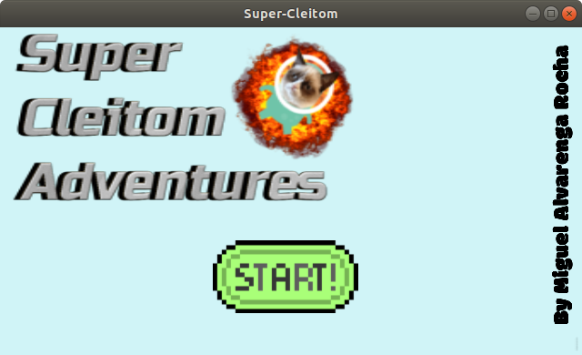

# Super Cleitom Godot
Jogo Mobile estilo Super Mario feito usando a engine <a href=https://downloads.tuxfamily.org/godotengine/2.1.4/>Godot 2.1.4</a> 
Assets: https://kenney.nl/assets/platformer-art-deluxe 
<a href="https://www.udemy.com/course/criacao-de-jogos-para-android-curso-completo">Base e Inspiração</a> 

# Sobre o Desenvolvimento

O jogo demorou 2 meses para ser feito tento começado no dia <a href="https://drive.google.com/file/d/18rdI9KFtt8xSM8KmcPE0ZJMmuLKL4X4C/view?usp=sharing">09/10/2020</a> e terminado no dia 15/12/2020. 
Com esse projeto aprendi muito sobre a engine Godot. Qualquer bug pode ser reportado na aba Issues.

# Downloads
Versão para <a href="https://github.com/miguelrochabh/GodotGames/raw/main/SuperCleitomGodot/bin/supercleitom.apk">Android</a> 
Versão para <a href="https://github.com/miguelrochabh/GodotGames/raw/main/SuperCleitomGodot/bin/supercleitom.run">Linux</a> 
Versão para <a href="https://github.com/miguelrochabh/GodotGames/raw/main/SuperCleitomGodot/bin/supercleitom.exe">Windows</a> 
